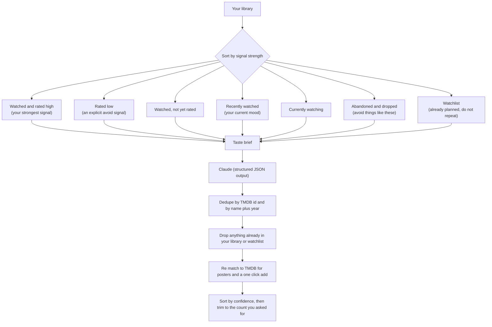
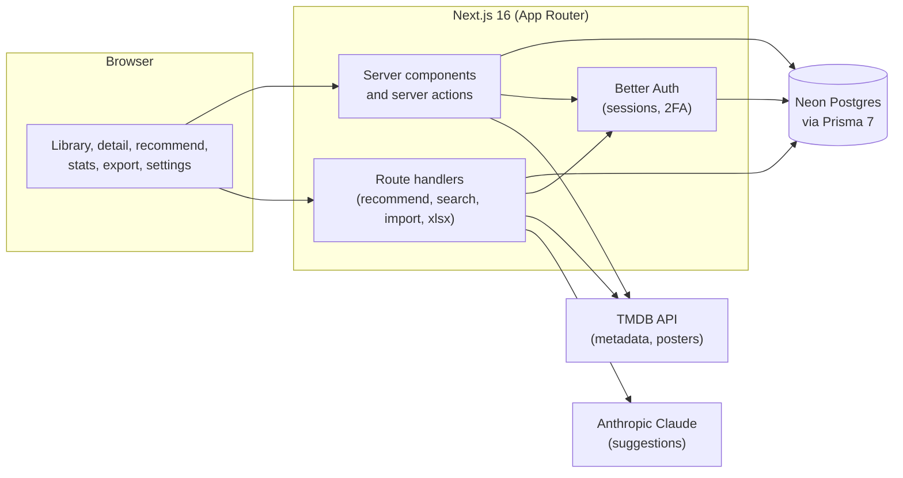
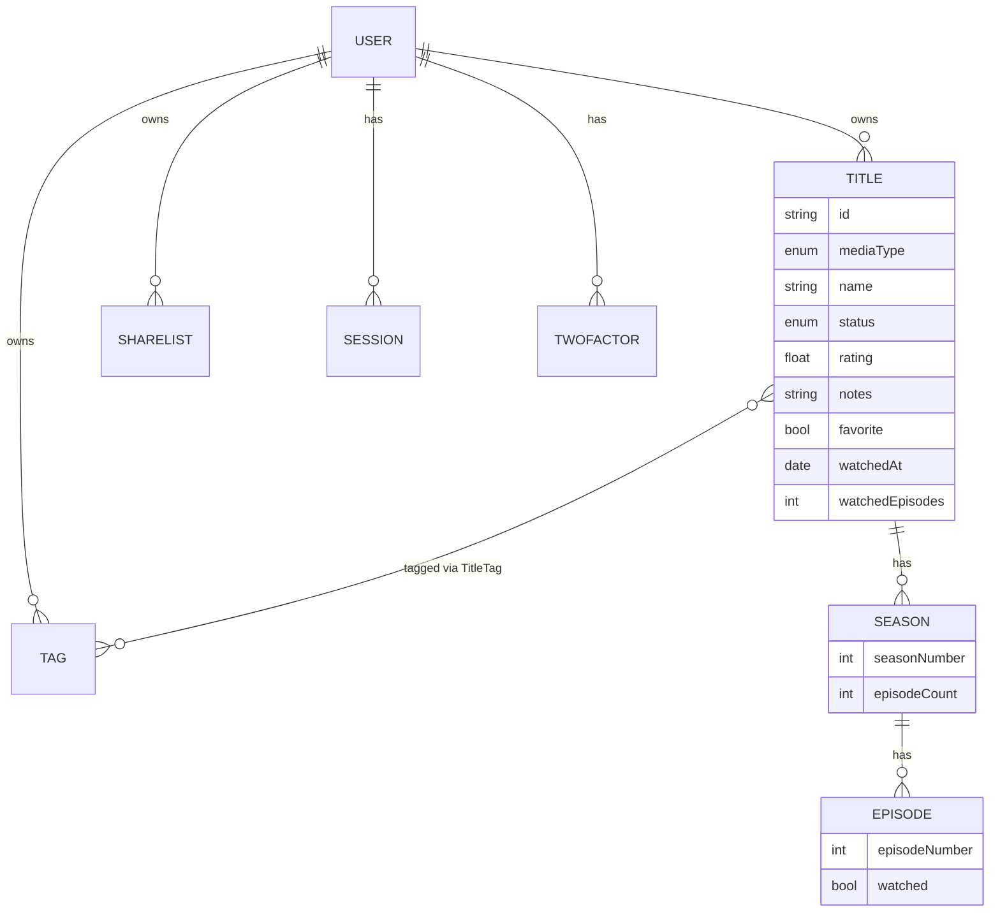

<div align="center">
  
  <h1>Celluloid</h1>
  <p>A private movie and TV tracker that turns your taste into what to watch next. You log what you have seen and how you felt about it, and Claude reads the whole picture to suggest your next film or show. It runs on your own database, behind your own login.</p>

  <p>
    <a href="https://mycelluloid.vercel.app">
      
    </a>
  </p>

  <p>
    
    
    
    
  </p>
  <p>
    
    
    
    
    
  </p>
</div>

> **Note**
>
> Celluloid is built for one person: you. The live app at [mycelluloid.vercel.app](https://mycelluloid.vercel.app) is real, but it sits behind a login, so there is nothing to browse without an account. You bring your own Neon database, your own TMDB token, and your own Anthropic key, then deploy your own copy. Sign ups can be closed with a single environment variable once your account exists.

Most trackers are good at storing what you watched and bad at the only question that matters afterward, which is what to watch tonight. Celluloid is built the other way around. Logging is quick, but everything feeds one feature: a recommendation engine that reads your ratings, your notes, the things you abandoned, what you watched recently, and the languages you actually lean toward, then asks Claude for titles that fit. You can run that inside the app, or copy the exact same brief as a prompt to paste into any other AI.

## Contents

- [What it does](#what-it-does)
- [The recommendation engine](#the-recommendation-engine)
- [Tracking your watch history](#tracking-your-watch-history)
- [The library](#the-library)
- [Stats](#stats)
- [Exports](#exports)
- [Sharing](#sharing)
- [Privacy and security](#privacy-and-security)
- [Architecture](#architecture)
- [Data model](#data-model)
- [Tech stack](#tech-stack)
- [Getting started](#getting-started)
- [Environment variables](#environment-variables)
- [Bringing in your library](#bringing-in-your-library)
- [Scripts](#scripts)
- [Deploying to Vercel](#deploying-to-vercel)
- [Project structure](#project-structure)
- [Keyboard and accessibility](#keyboard-and-accessibility)
- [Notes and limitations](#notes-and-limitations)

## What it does

- Tracks films and TV in one library, with TMDB metadata, posters, seasons, and episodes pulled in automatically
- Half star ratings from 0.5 to 10, private notes, favorites, and free form tags
- Per episode and per season tracking for shows, with a progress bar and quick "mark season" and "mark show" actions
- Five watch states that map to a real backlog: watchlist, watching, watched, on hold, dropped
- AI recommendations from Claude, based on a detailed picture of your taste, with mood presets, language, genre, and era preferences, and the option to base them on your whole library, your recent watches, or a hand picked set
- A "copy as AI prompt" export, so the same brief works in any chat assistant
- Search, rich filtering, two layouts, and bulk editing across a large library
- A surprise picker that pulls something random off your watchlist when you cannot decide
- Stats with a watch activity heatmap, streaks, rating distribution, titles by year, and top rated
- Public, read only share links for a list or your whole library
- Exports to plain text, Markdown, JSON, and a styled Excel workbook, scoped as finely as language, genre, minimum rating, and release years, with filenames that say what is inside
- Accounts with email and password, optional two factor, and a switch to close public sign ups

## The recommendation engine

This is the reason the app exists. When you ask for suggestions, Celluloid does not send a flat list of titles. It builds a structured brief that separates the signals by how much they tell Claude about your taste, then it cleans up the results.

**How the brief is built**



A few details that make the output better:

- **High and low both count.** Titles you rated highly drive the positive direction. Titles you rated low get their own block that tells Claude to avoid similar things, so half of your signal is not wasted.
- **Language lean is computed, not assumed.** The brief states the languages you actually rate and favorite, so a model does not default to English language picks when your taste runs elsewhere.
- **Recency reflects mood.** Titles you finished in the app recently are weighted as your current direction. Imported titles that never had a real watch date stay quiet, so the app never fakes recency.
- **No repeats.** Suggestions are checked against your whole library by TMDB id and by a normalized name plus year, which also catches regional titles that were never matched to TMDB.
- **Honest confidence.** Each pick comes back with a confidence level, and the list is sorted high to low before it is trimmed, so a strong pick is never dropped in favor of a weak one.

**Where suggestions come from**

| Basis | What it uses | Good for |
| --- | --- | --- |
| Whole library | Everything you have logged | General "what next" |
| Recent watches | Your most recent finishes (last 10, 20, or 50) | Matching your current mood |
| Pick titles | A set you choose by hand | "More things like these three" |

You can steer a run with a free text focus ("cozy mysteries", "something like Bramayugam", "90s sci fi") or tap a mood preset. Three dropdowns narrow the pool further: original language, genre, and era, from the 2020s back to before 1970. A preference becomes a hard requirement in the brief, confirmed matches float to the top of the results, and your dial settings persist for the browsing session. A "show different" button keeps the same brief but excludes everything already shown, so you can keep pulling fresh ideas. Unmatched suggestions still appear with a "find on TMDB" link so you can add them by hand.

**Models.** Claude Opus is the default. Sonnet and Haiku are selectable per run from the recommend page. The app adapts the request to each model: Opus and Sonnet use adaptive thinking and an effort setting, Haiku skips the options it does not support. Output is constrained to a JSON schema, and long responses are streamed so a request never times out.

**Bring your own key.** Add an Anthropic key in settings and it is encrypted at rest with AES 256 GCM before it touches the database. A deployment wide key can also be set as a fallback.

## Tracking your watch history

Every title carries personal tracking on top of its TMDB metadata.

| Status | Meaning |
| --- | --- |
| Watchlist | Want to watch |
| Watching | In progress |
| Watched | Finished |
| On hold | Paused for now |
| Dropped | Gave up on it |

- **Half star ratings** run from 0.5 to 10. Click the left or right half of a star, or use the keyboard (arrow keys nudge by half or whole steps, 0 clears).
- **Notes** are private and double as context for the AI. Favorites and tags layer on top, and tags also work as a recommendation lens.
- **TV is tracked properly.** Shows expand into seasons and episodes. Tick a single episode, a whole season, or the whole show. Progress is denormalized for a fast bar on the card, and finishing a show stamps a watch date so it counts toward recency and stats.

## The library

The home screen is your whole collection, in a poster grid or a dense list.

| Control | Options |
| --- | --- |
| Search | Live filter by title |
| Type | Movies, TV, or both |
| Status | Any of the five watch states |
| Language | Any original language in your library |
| Genre | Any genre present |
| Rating | Unrated, or 5 and up through 9 and up |
| Tag | Any tag you have created |
| Needs match | Only titles with no TMDB match, for cleanup |
| Sort | Recently added, recently watched, name, release date, your rating, TMDB rating |

On phones the filters collapse behind a single toggle and lay out as a clean two column drawer. Your filter, sort, and layout choices persist as you move around, so opening a title and coming back keeps your place while you work through a backlog.

**Bulk editing.** Switch on select mode and act on many titles at once: set a status, add or remove a tag, favorite or unfavorite, share, or remove. Selection is always scoped to what is visible, so a bulk action can never touch a hidden title.

**Surprise me.** One press picks a random title from the current view, preferring whatever is still on your watchlist, and takes you straight to it. Filter down to unwatched Malayalam horror first and the dice roll respects it.

**Export these.** When filters are active, a one click link opens the export page with the same scope already applied, so "everything tagged for horror night as a spreadsheet" is two clicks.

**Command palette.** Press the search button or use the keyboard shortcut to jump to any title or page from anywhere.

## Stats

The stats page reads your activity rather than just counting rows.

- Totals for titles, movies, shows, movies watched, and episodes watched
- An estimated watch time, with an honest note that episodes without a known runtime are estimated at about 42 minutes each
- A watch activity heatmap and current and longest streaks, built from real in app watch dates
- Titles by release year as a sparkline, a rating distribution histogram, and a by decade breakdown
- Your top rated titles and a language breakdown

Because the imported backlog starts without watch dates, the activity views begin empty and fill in as you mark things watched in the app. The page says so plainly rather than showing a misleading blank.

## Exports

Everything in your library can leave in the shape you need. Pick a scope (type, status, language, genre, minimum rating, release year range, favorites only, a tag) and a format, then copy or download.

| Format | File | Best for |
| --- | --- | --- |
| AI prompt | `.txt` | Pasting into any chat assistant for recommendations |
| Text | `.txt` | A quick human readable list |
| Markdown | `.md` | A table you can drop into notes or a gist |
| JSON | `.json` | Feeding another tool |
| Excel | `.xlsx` | A styled workbook with separate Movies and TV sheets |

The AI prompt export uses the exact same taste brief as the in app engine. Even when you scope the export down, the "do not recommend these" guardrails are still drawn from your full watchlist and dropped lists, so a scoped prompt never contradicts itself.

Every download gets a unique, descriptive filename, for example `celluloid-library-movie-malayalam-8plus-1990-1999-20260613-101500.xlsx`, so repeated exports never overwrite each other and a saved file tells you what it holds at a glance.

## Sharing

You can publish a read only snapshot of your library, or just a selection, at an unguessable link under `/s/`. Shared pages need no login and are marked no index. Notes are hidden unless you opt in, and a whole library share hides your not yet watched watchlist by default so you are not broadcasting your plans. Every link is listed in settings, where you can copy or revoke it.

## Privacy and security

This is your data on your infrastructure.

- Self hosted on your own Neon database. There is no shared backend and no third party account system.
- Every query is scoped to the signed in user, so one account can never read another's titles, tags, shares, or settings.
- Your Anthropic key is encrypted at rest with AES 256 GCM. It is never stored or logged in plaintext.
- Accounts use email and password through Better Auth, with optional time based two factor (an authenticator app, with backup codes and a manual setup key). Sessions are stored in the database, and deleting your account requires your password, not just a live session.
- Sign in, sign up, password change, and two factor verification are rate limited against brute force, and the AI, search, import, and export routes are rate limited per user to keep a runaway loop from draining your API budget.
- Public sign ups can be closed with `DISABLE_SIGNUPS=true` once your own account exists, which is the recommended state for a personal deployment.
- Security headers are set for every response: frame denial, no sniff, a strict referrer policy, a content security policy covering framing, plugins, base tags, and form targets, a permissions policy that turns off browser capabilities the app never uses, and HSTS on the production domain.
- Server side input validation bounds every free text field, and `npm audit` runs clean with pinned overrides for transitive advisories.

## Architecture

Celluloid is a normal Next.js App Router application. Pages render on the server, talk to Postgres through a Prisma driver adapter, and reach two outside services: TMDB for metadata and Anthropic for recommendations. There is no separate API server to run.



Reads and simple mutations go through server components and server actions. The work that can be slow or large (asking Claude, searching TMDB, parsing an uploaded sheet, building an Excel file) runs in route handlers with a longer timeout. The Anthropic call is streamed and the recommendation response is constrained to a JSON schema, so the server gets clean structured data back instead of free text to parse.

## Data model

A user owns titles, tags, and share lists. A title can be a movie or a show. Shows own seasons, seasons own episodes. Tags attach to titles through a join table. Auth tables (sessions, accounts, two factor) hang off the user as well.



Titles are unique per user by media type and TMDB id, and the denormalized `watchedEpisodes` count keeps the progress bar fast without walking every episode on each render.

## Tech stack

| Area | Choice |
| --- | --- |
| Framework | Next.js 16, App Router, Turbopack |
| UI | React 19 |
| Language | TypeScript |
| Styling | Tailwind CSS 4 |
| Database | Postgres on Neon |
| ORM | Prisma 7 with the pg driver adapter |
| Auth | Better Auth, with the two factor plugin |
| Metadata | TMDB (The Movie Database) |
| AI | Anthropic Claude (Opus, Sonnet, Haiku) |
| Animation | Motion |
| Command palette | cmdk |
| Dialogs | Radix UI |
| Toasts | Sonner |
| Icons | Lucide |
| Spreadsheets | ExcelJS |
| Tests | Node test runner through tsx |

## Getting started

You need Node.js 20 or newer, a Neon Postgres database, a TMDB API Read Access Token, and (for AI features) an Anthropic API key.

**1. Install dependencies.** This also generates the Prisma client through a postinstall step.

```bash
npm install
```

**2. Set up your environment.** Copy the example file and fill in real values. See [Environment variables](#environment-variables) for what each one is.

```bash
cp .env.example .env
```

**3. Create the database schema.** This applies the migrations to your Neon database.

```bash
npm run db:deploy
```

**4. Start the dev server.**

```bash
npm run dev
```

Open http://localhost:3000, create your account, then add a few titles by searching TMDB. Add an Anthropic key in settings and open the recommend page to see suggestions. Once your account exists, set `DISABLE_SIGNUPS=true` to close the door behind you.

## Environment variables

Copy `.env.example` to `.env`. Never commit `.env`; it is already ignored.

| Variable | Required | What it is |
| --- | --- | --- |
| `DATABASE_URL` | Yes | Neon pooled connection string (host contains `-pooler`). Used at runtime. |
| `DIRECT_URL` | For migrations | Neon direct connection string (no pooler). Used only for migrations. Falls back to `DATABASE_URL` if unset. |
| `TMDB_ACCESS_TOKEN` | Yes | The TMDB v4 API Read Access Token (the long token starting with `eyJ`). Server side only. |
| `BETTER_AUTH_SECRET` | Yes | A long random secret for signing sessions. |
| `BETTER_AUTH_URL` | Yes | The app base URL. Local is `http://localhost:3000`, production is your deployed URL. |
| `NEXT_PUBLIC_SITE_URL` | Yes | Public base URL for metadata and the auth client. Match `BETTER_AUTH_URL`. |
| `ENCRYPTION_KEY` | Recommended | Key for encrypting per user Anthropic keys at rest. Falls back to `BETTER_AUTH_SECRET` if unset. |
| `ANTHROPIC_API_KEY` | Optional | A deployment wide Claude key, used when a user has not added their own. |
| `DISABLE_SIGNUPS` | Optional | Set to `true` to close public sign ups. Existing users can still sign in. |

## Bringing in your library

There are three ways to get titles in, and they all enrich from TMDB (posters, seasons, episodes, genres, runtime, original language).

1. **Search and add.** The fastest path for a handful of titles. Search TMDB inside the app and add with one click.
2. **Upload a sheet.** The in app importer accepts an `.xlsx` or `.csv` file of titles and matches each one to TMDB.
3. **Import the legacy workbook.** If you are coming from a "Movies and TV Shows Watched" style spreadsheet with separate sheets, drop it at `data/watched.xlsx` and run the importer:

```bash
npm run import
```

The importer reads the title, release date, and status columns, matches each row to TMDB (with a guard that prevents a wrong poster from being attached to a transliterated or regional title), and pulls season and episode structure for shows. Your own `data/watched.xlsx` is kept out of git, since it is personal.

## Scripts

| Script | What it does |
| --- | --- |
| `npm run dev` | Start the local dev server |
| `npm run build` | Production build |
| `npm run start` | Run the production build locally |
| `npm run lint` | Run ESLint |
| `npm test` | Run the test suite on Node's built in runner (Node 21 or newer) |
| `npm run db:deploy` | Apply migrations to the database |
| `npm run db:migrate` | Create and apply a new migration in development |
| `npm run db:generate` | Regenerate the Prisma client |
| `npm run db:studio` | Open Prisma Studio to browse the data |
| `npm run import` | Import the legacy Excel workbook from `data/watched.xlsx` |

## Deploying to Vercel

The app is a standard Next.js project and runs well on Vercel.

1. Push this repository to GitHub.
2. Import the project into Vercel.
3. Add every variable from the [Environment variables](#environment-variables) table in the Vercel project settings. Set `BETTER_AUTH_URL` and `NEXT_PUBLIC_SITE_URL` to your real deployed URL.
4. Deploy. The build runs `prisma generate`, applies migrations with `prisma migrate deploy`, then builds Next.

A short checklist for a clean first deploy:

- [ ] Use fresh secrets in production. Rotate anything that has been on a local machine: the Neon password, the TMDB token, the Anthropic key, `BETTER_AUTH_SECRET`, and `ENCRYPTION_KEY`.
- [ ] Both `BETTER_AUTH_URL` and `NEXT_PUBLIC_SITE_URL` point at the production URL.
- [ ] `DATABASE_URL` is the pooled string and `DIRECT_URL` is the direct one.
- [ ] Create your account on the live site, then set `DISABLE_SIGNUPS=true` and redeploy.

## Project structure

```text
celluloid/
├── prisma/
│   ├── schema.prisma          data model
│   └── migrations/            Neon migration history
├── public/
│   ├── logo.png
│   └── icon-192.png
├── scripts/
│   └── import-excel.ts        importer for the legacy workbook
├── src/
│   ├── app/
│   │   ├── (app)/             signed in pages: library, add, title, recommend, export, stats, settings
│   │   ├── api/               route handlers: recommend, search, titles, import, export/xlsx, auth
│   │   ├── login/
│   │   ├── s/[slug]/          public read only shared lists
│   │   ├── layout.tsx, globals.css, manifest.ts, robots.ts
│   │   └── error.tsx, not-found.tsx, global-error.tsx
│   ├── components/            library, cards, charts, dialogs, command palette, rating stars, nav
│   ├── generated/prisma/      generated Prisma client (not committed)
│   └── lib/                   auth, prisma, tmdb, recommend, export, import, data, actions, crypto, rate limiting
├── tests/                     pure logic tests: matching, export scope, filenames, prompt, crypto
├── proxy.ts                   Next 16 request proxy (this version uses proxy, not middleware)
├── next.config.ts             security headers and the TMDB image allowlist
├── prisma.config.ts
├── .env.example
└── package.json
```

## Keyboard and accessibility

- A command palette opens from the header for fast navigation to any title or page.
- The star rating is fully operable from the keyboard: arrow keys nudge by half or whole steps, Home and End jump to the ends, and 0 clears.
- Every interactive control has a visible focus ring, icon only buttons carry labels, and toggles report their pressed state to screen readers.
- The card hover lift and other motion respect the system "reduce motion" setting.

## Notes and limitations

- Celluloid is a personal tool, not a multi tenant service. It supports more than one account, but it is meant to be locked to one with `DISABLE_SIGNUPS` after setup.
- An imported backlog has no ratings or watch dates at first, so the recommendation quality and the activity stats both improve as you rate titles and mark things watched. The "unrated" filter is the quick way to work through that.
- TMDB matching is automatic and usually right, but a transliterated or regional title can occasionally match the wrong entry. The "needs match" filter and the per title "change match" control are there to fix those by hand.
- The in memory rate limiter bounds bursts per server instance. For a single user deployment that is plenty; a busy multi user instance would want a shared store.
