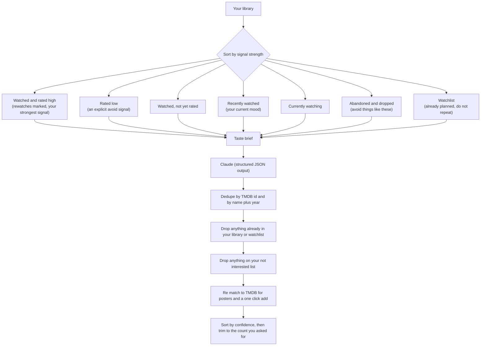
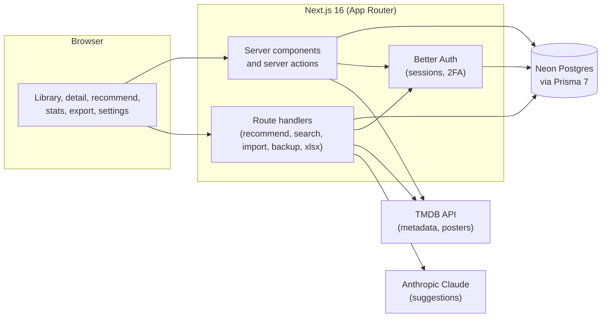
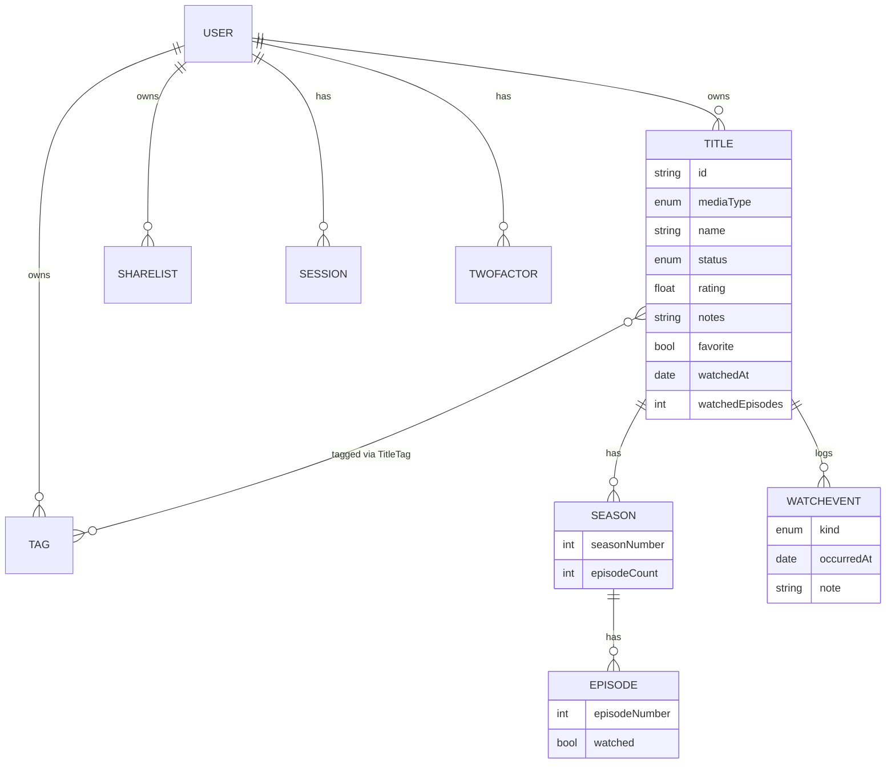

<div align="center">
  
  <h1>Celluloid</h1>
  <p>A private movie and TV tracker that turns your taste into what to watch next. You log what you have seen and how you felt about it, and Claude reads the whole picture to suggest your next film or show. It runs on your own database, behind your own login.</p>

  <p>
    <a href="https://mycelluloid.vercel.app">
      
    </a>
  </p>

  <p>
    
    
    
    
  </p>
  <p>
    
    
    
    
    
  </p>
</div>

> **Note**
>
> Celluloid is built for one person: you. The live app at [mycelluloid.vercel.app](https://mycelluloid.vercel.app) is real, but it sits behind a login, so there is nothing to browse without an account. You bring your own Neon database, your own TMDB token, and your own Anthropic key, then deploy your own copy. Sign ups are closed by default, opened with a shared invite code only long enough to create your account.

Most trackers are good at storing what you watched and bad at the only question that matters afterward, which is what to watch tonight. Celluloid is built the other way around. Logging is quick, but everything feeds one feature: a recommendation engine that reads your ratings, your notes, the things you abandoned, what you watched recently, and the languages you actually lean toward, then asks Claude for titles that fit. You can run that inside the app, or copy the exact same brief as a prompt to paste into any other AI.

## Contents

- [What it does](#what-it-does)
- [The recommendation engine](#the-recommendation-engine)
- [Tracking your watch history](#tracking-your-watch-history)
- [Keeping metadata current](#keeping-metadata-current)
- [The library](#the-library)
- [Stats](#stats)
- [Exports](#exports)
- [Backups and recovery](#backups-and-recovery)
- [Sharing](#sharing)
- [Privacy and security](#privacy-and-security)
- [Architecture](#architecture)
- [Data model](#data-model)
- [Tech stack](#tech-stack)
- [Getting started](#getting-started)
- [Environment variables](#environment-variables)
- [Bringing in your library](#bringing-in-your-library)
- [Scripts](#scripts)
- [Deploying to Vercel](#deploying-to-vercel)
- [Project structure](#project-structure)
- [Keyboard and accessibility](#keyboard-and-accessibility)
- [Notes and limitations](#notes-and-limitations)

## What it does

- Tracks films and TV in one library, with TMDB metadata, posters, seasons, and episodes pulled in automatically
- Every matched title shows where to stream, rent, or buy it (region-aware, via JustWatch data), a trailer link, and a "More like this" row you can add from in one click
- Half star ratings from 0.5 to 10, private notes, favorites, and free form tags
- Per episode and per season tracking for shows, with a progress bar, quick "mark season" and "mark show" actions (marking a show watched comes with an Undo that also clears the activity it wrote), and a quiet "New" badge once a watching show has an aired episode you have not logged yet
- A nightly job re-reads TMDB for the shows you are still watching, so a new season appears in the library on its own instead of waiting for you to refresh the title by hand
- Every viewing is logged to a private watch history, with an optional note. Logging again on a title you already finished counts as a rewatch instead of overwriting the first watch. A viewing logged on the wrong day, or twice, can be edited or deleted from the title page
- Five watch states that map to a real backlog: watchlist, watching, watched, on hold, dropped
- AI recommendations from Claude, based on a detailed picture of your taste, with mood presets, language, genre, and era preferences, and the option to base them on your whole library, your recent watches, or a hand picked set
- A suggestion you turn down stays turned down: "not interested" is stored, so it is excluded from every future run, with a list you can review and undo from
- A "copy as AI prompt" export, so the same brief works in any chat assistant
- Search, rich filtering, two layouts, and bulk editing across a large library. Search ignores accents, so "amelie" finds "Amélie"
- Soft delete: removing a title moves it to Trash with every piece of personal data intact, ready to restore, delete forever, or empty in one action
- Uploading a spreadsheet stages a review: Celluloid proposes a TMDB match for every row, you fix or exclude what is wrong, then commit in resumable batches you can leave and pick back up later. Ratings, watch dates, and IMDb or TMDB ids come across if your sheet has them
- Free form tags you can rename and give one of five colors, from the title page or Settings
- A surprise picker that pulls something random off your watchlist when you cannot decide
- Stats built from real activity: a heatmap whose days open to show what you watched, streaks, rating distribution, taste and totals by genre, and your most rewatched titles
- Public, read only share links for a list or your whole library, with an optional expiry, a revoke switch that pulls access without deleting the link's record, and a per link view of exactly which titles a visitor sees
- A full JSON backup you can restore with a preview first, so nothing writes to your library until you confirm exactly what will change, and a note in Settings of when you last took one
- Time zone and a default watch region in Settings. The time zone sets stats day boundaries; the region decides whose streaming, rental, and certification info you see, and a per device selector on a title page can override it
- Exports to plain text, Markdown, JSON, and a styled Excel workbook, scoped as finely as language, genre, minimum rating, and release years, with filenames that say what is inside
- Invite-only accounts with email and password, plus optional two-factor authentication

## The recommendation engine

This is the reason the app exists. When you ask for suggestions, Celluloid does not send a flat list of titles. It builds a structured brief that separates the signals by how much they tell Claude about your taste, then it cleans up the results.

**How the brief is built**


```mermaid
flowchart TD
    A["Your library"] --> B{"Sort by signal strength"}
    B --> C["Watched and rated high<br/>(rewatches marked, your strongest signal)"]
    B --> D["Rated low<br/>(an explicit avoid signal)"]
    B --> E["Watched, not yet rated"]
    B --> F["Recently watched<br/>(your current mood)"]
    B --> G["Currently watching"]
    B --> H["Abandoned and dropped<br/>(avoid things like these)"]
    B --> I["Watchlist<br/>(already planned, do not repeat)"]
    C --> J["Taste brief"]
    D --> J
    E --> J
    F --> J
    G --> J
    H --> J
    I --> J
    J --> K["Claude (structured JSON output)"]
    K --> L["Dedupe by TMDB id and by name plus year"]
    L --> M["Drop anything already in your library or watchlist"]
    M --> P["Drop anything on your not interested list"]
    P --> N["Re match to TMDB for posters and a one click add"]
    N --> O["Sort by confidence, then trim to the count you asked for"]
```

A few details that make the output better:

- **High and low both count.** Titles you rated highly drive the positive direction. Titles you rated low get their own block that tells Claude to avoid similar things, so half of your signal is not wasted.
- **Rewatches outrank ratings.** A title you logged more than once is marked with how many times you watched it, and the brief states the ranking plainly: going back to something says more than any single score. The marker only appears once your history actually contains a rewatch, so it never spends prompt space on a legend nothing uses.
- **Turn downs stick.** Dismissing a suggestion as "not interested" records it against your account, not just the open page. It is filtered out of every later run, and it is named in the brief's exclusion clause so the model spends its picks elsewhere. The Not interested list on the recommend page shows what you have turned down and puts any of it back.
- **Language lean is computed, not assumed.** The brief states the languages you actually rate and favorite, so a model does not default to English language picks when your taste runs elsewhere.
- **Recency reflects mood.** Titles you finished recently are weighted as your current direction. That includes a watch date an imported sheet supplied, because it is a real date; what the app will not do is invent one for a row that arrived without it.
- **No repeats.** Suggestions are checked against your whole library, Trash included, by TMDB id and by a normalized name plus year, which also catches regional titles that were never matched to TMDB.
- **Honest confidence.** Each pick comes back with a confidence level, and the list is sorted high to low before it is trimmed, so a strong pick is never dropped in favor of a weak one.
- **Scoped runs stay scoped.** Base a run on recent watches or hand picked titles and the rest of your library enters the brief only as names and years to avoid. Notes, ratings, and tags on titles outside the basis never leave the app.
- **Requirements are checked, not just requested.** A language, genre, or era pick is verified against TMDB's own record for every suggestion that resolves, and a pick that fails is dropped, along with anything TMDB dates in the future. When that shortens a batch, the run says so rather than quietly padding the list with near misses.
- **An outage is not a no-match.** When TMDB cannot be reached, the affected suggestions still appear, flagged once as unverified. A title TMDB has never heard of arrives with a "find on TMDB" link instead, because for regional cinema that absence is normal.

**Where suggestions come from**

| Basis | What it uses | Good for |
| --- | --- | --- |
| Whole library | Everything you have logged | General "what next" |
| Recent watches | Your most recent finishes (last 10, 20, or 50) | Matching your current mood |
| Pick titles | A set you choose by hand | "More things like these three" |

You can steer a run with a free text focus ("cozy mysteries", "something like Bramayugam", "90s sci fi") or tap a mood preset. Three dropdowns narrow the pool further: original language, genre, and era, from the 2020s back to before 1970. A preference becomes a hard requirement, enforced against TMDB's record for every suggestion that resolves, and your dial settings are remembered on this device between visits (the Settings toggle described under The library turns that off). A "show different" button keeps the same brief but excludes everything already shown, so you can keep pulling fresh ideas. Unmatched suggestions still appear with a "find on TMDB" link so you can add them by hand.

**Results stream in live.** The app doesn't wait for the whole batch: Claude's response is parsed as it streams, each suggestion is validated, deduplicated, and matched to TMDB the moment it completes, and cards appear one by one with a status line ("thinking", "curating picks", a running count) and a Stop button. Once enough suggestions have been accepted, generation is aborted server-side, so you never pay for output past what you asked for.

**Models.** Claude Sonnet 5 is the default. Claude Opus 5 and Claude Haiku 4.5 are selectable per run from the recommend page. The app adapts the request to each model: Opus 5 and Sonnet 5 get adaptive thinking and an effort setting, while Haiku 4.5 skips both options because it rejects them. Output is constrained to a JSON schema, and the taste brief carries an Anthropic prompt-cache breakpoint, so once your library is large enough to clear the chosen model's cache minimum, a "Show different" re-run a few minutes later reprocesses only the short request block instead of your whole taste brief. That minimum differs per model and is not lower on newer ones, so the breakpoint is attached only when the brief plausibly clears the bar for the model you picked.

**Bring your own key.** Add an Anthropic key in settings and it is encrypted at rest with AES 256 GCM before it touches the database. A deployment wide key can also be set as a fallback, and the recommend page always states which one a run is about to use.

## Tracking your watch history

Every title carries personal tracking on top of its TMDB metadata.

| Status | Meaning |
| --- | --- |
| Watchlist | Want to watch |
| Watching | In progress |
| Watched | Finished |
| On hold | Paused for now |
| Dropped | Gave up on it |

- **Half star ratings** run from 0.5 to 10. Click the left or right half of a star, or use the keyboard (arrow keys nudge by half or whole steps, 0 clears).
- **Notes** are private and double as context for the AI. Favorites and tags layer on top, and tags also work as a recommendation lens.
- **Tags are editable.** Rename a tag anywhere it appears and every title follows, or give it one of five colors so it reads as a category at a glance. Settings lists every tag with how many live titles carry it, which is also where a tag is deleted.
- **TV is tracked properly.** Shows expand into seasons and episodes. Tick a single episode, a whole season, or the whole show. Progress is denormalized for a fast bar on the card, and finishing a show stamps a watch date so it counts toward recency and stats. An episode that turned up after you added the show, has aired, and is not ticked off puts a small "New" badge on its card, on any show except one you have dropped.
- **Log watch** records a dated viewing with an optional note, from the title page. The first log on a title stamps its watch date; logging again on an already watched title is recorded as a rewatch and adds to the running count on that title and on the stats page. The History row for the first viewing is untouched, and the title's own watch date reflects the latest viewing.
- **History is correctable.** The watch log is append only by design, since stats and streaks are built from it, but a viewing logged on the wrong day or logged twice by a double tap can be edited or deleted from the History list on the title page. Either way the title's watch date is re-derived from the log on the server, so the two cannot drift apart.

## Keeping metadata current

A title used to be frozen at whatever TMDB said on the day you added it, so a show that came back for another season stayed at its old episode count until you refreshed it by hand. A scheduled job closes that gap.

`vercel.json` registers one cron entry, `/api/cron/sync`, which runs daily at 07:00 UTC. For each account it takes the fifty least recently synced shows, oldest (and never synced) first, and re-reads them from TMDB. It skips dropped shows, and shows TMDB reports as ended or cancelled once they have been synced at least once, so the budget goes to series that can still change.

- Episodes are matched by their TMDB id, so a renumbered episode keeps its watched tick, and they are updated in place rather than deleted and recreated. That is what keeps the "New" badge meaningful: the badge keys on when an episode row first appeared, so rewriting every row nightly would mark the whole library as new and destroy the signal.
- An episode the sync stores for the first time only counts as newly discovered if it aired in the last month or has yet to air. A show added with some of its seasons missing gets them filled in eventually, and that back catalogue is dated to the title rather than to the night it arrived, so a season from 2015 does not turn up wearing a "New" badge.
- An episode TMDB withdraws is removed if you never watched it. If you had ticked it, the row stays with your tick and its history but leaves the progress count and the "New" badge, so the show can still reach 100%. If TMDB lists the episode again, the row comes back as it was.
- Each run records the show's TMDB status, the air date of its next episode, and when the title was last synced along with the last error if there was one. It also caches which services carry the show in your Settings watch region; the library's "On my services" filter reads that cache against the services you pick in Settings (see [Notes and limitations](#notes-and-limitations)).
- One title's failure is recorded against that title and the run continues. Whatever the run does not reach keeps its place at the front of the queue and goes first the next day.
- The run has a wall clock budget, and a title in flight when it runs out stops fetching rather than finishing at its own pace, since one show with hundreds of episodes could otherwise start just under the wire and overrun the function limit. A title dropped that way is not marked as failed; it stays at the front of the queue. With more than one account the remaining budget is split evenly between the accounts still to go, so a later account cannot be starved by an earlier one.

The endpoint accepts no input other than its credential. It requires `Authorization: Bearer $CRON_SECRET` and compares the header in constant time; if `CRON_SECRET` is not set it refuses every request rather than falling back to running unauthenticated. Vercel sends that header for scheduled invocations once the variable is set on the project. Without it the app works exactly as before, just without the nightly refresh.

Every authorized run logs one single-line JSON summary (status, per-account counters, and any error), so a night's result is one log event instead of scattered output. A title whose refresh keeps failing also surfaces in Settings, under "Metadata refresh," with its stored error and a link straight to the title.

## The library

The home screen is your whole collection, in a poster grid or a dense list.

| Control | Options |
| --- | --- |
| Search | Live filter by title |
| Type | Movies, TV, or both |
| Status | Any of the five watch states |
| Language | Any original language in your library |
| Genre | Any genre present |
| Rating | Unrated, or 5 and up through 9 and up |
| Tag | Any tag you have created |
| Needs match | Only titles with no TMDB match, for cleanup |
| Sort | Recently added, recently watched, name, release date, your rating, TMDB rating |

On phones the filters collapse behind a single toggle and lay out as a clean two column drawer. Your filter, sort, and layout choices live in the URL, so a filtered view is bookmarkable and shareable, and pressing Back after opening a title returns you to exactly the view you left while you work through a backlog. In the dense list view, offscreen rows skip rendering entirely (`content-visibility`), so even a very long list stays fast.

**Filters that remember themselves.** Arrive with a plain URL and the library restores the filters, sort, and layout you last used on that device; an explicit link always wins over the memory, so a URL you share shows the recipient what the URL says, not what your device remembers. The recommend page's dials and the export page's format and scope are remembered the same way. Search text is never saved. All of it sits behind one Settings toggle, on by default, and switching the toggle off deletes everything already remembered on that device.

**Bulk editing.** Switch on select mode and act on many titles at once: set a status, add or remove a tag, favorite or unfavorite, share, or remove. Selection is always scoped to what is visible, so a bulk action can never touch a hidden title.

**Surprise me.** One press picks a random title from the current view, preferring whatever is still on your watchlist, and takes you straight to it. Filter down to unwatched Malayalam horror first and the dice roll respects it.

**Export these.** When filters are active, a one click link opens the export page with the same scope already applied, so "everything tagged for horror night as a spreadsheet" is two clicks.

**Command palette.** Press the search button or use the keyboard shortcut to jump to any title or page from anywhere.

## Stats

The stats page reads your activity rather than just counting rows.

- Totals for titles, movies, shows, movies watched, episodes watched out of episodes tracked, and rewatches
- A watch time built from real per title and per episode runtimes. Episodes with no known runtime count as about 42 minutes each, movies with no known runtime count as about 110 minutes each, and the page says how many of each there were. When every watched title and episode has a runtime, there is nothing to qualify and the note does not appear
- A watch activity heatmap and current and longest streaks, built from real in app watch dates. Selecting a day opens what you watched that day, with a link to each title; the arrow keys move between days
- Titles by release year as a sparkline, a rating distribution histogram, and a by decade breakdown
- Your top rated titles, your most rewatched titles, and a by status and by language breakdown
- Taste by genre: your average rating per genre, for genres with at least two rated titles, alongside a top genres count by how often each appears in your library

Because the activity views are built from logged watch events, and an import never writes one, they begin empty for an imported backlog and fill in as you mark things watched in the app. The page says so plainly rather than showing a misleading blank.

## Exports

Everything in your library can leave in the shape you need. Pick a scope (type, status, language, genre, minimum rating, release year range, favorites only, a tag) and a format, then copy or download.

| Format | File | Best for |
| --- | --- | --- |
| AI prompt | `.txt` | Pasting into any chat assistant for recommendations |
| Text | `.txt` | A quick human readable list |
| Markdown | `.md` | A table you can drop into notes or a gist |
| JSON | `.json` | Feeding another tool |
| Excel | `.xlsx` | A styled workbook with separate Movies and TV sheets, each row carrying its TMDB id for an exact re-import |

The AI prompt export uses the exact same taste brief as the in app engine, rewatch markers and all. Even when you scope the export down, the "do not recommend these" guardrails are still drawn from your full watchlist and dropped lists, so a scoped prompt never contradicts itself.

Every download gets a unique, descriptive filename, for example `celluloid-library-movie-ml-8plus-1990-1999-20260613-101500.xlsx`, so repeated exports never overwrite each other and a saved file tells you what it holds at a glance. The language segment is the ISO code the filter uses (`ml` for Malayalam), which keeps the whole name safe to put in a download header.

## Backups and recovery

Celluloid has an application-level backup for the personal data that would be painful to rebuild. In **Settings > Backup**, choose **Download backup** to save a versioned JSON file. The current v2 format contains movie and TV metadata, soft-deleted titles, status, ratings, favorites, notes, watch dates and watch-event history, full season and episode progress, tags with their colors and their title joins, owner timezone/region preferences, and ordered shared-list settings including expiry and revocation. Restore also accepts v1 files through an explicit compatibility upgrade, for files up to 4 MB. If your library's backup would exceed that same 4 MB restore limit, the download refuses with a clear error instead of handing you a file it could never restore, and Settings' "last backed up" stamp is not updated; use `npm run db:dump` for a library that large. Backups deliberately exclude passwords, sessions, two-factor secrets and backup codes, encrypted API keys, and share slugs. Your "not interested" list is included and is restored with the rest of your data; a staged spreadsheet import is not, since it is working state that is cheap to rebuild. A restored shared list receives a new unguessable link instead of reviving an old bearer token.

Settings records when you last downloaded a backup, so the button tells you how stale your off-site copy is instead of giving no feedback at all. The stamp is written as the file starts streaming; whether it reached your disk is not something the server can see.

To restore, select the JSON file and a mode, then choose **Preview restore**. The preview reports how many titles will be created, updated, left unchanged, or skipped as conflicts. Nothing is written until you approve the confirmation dialog.

- **Merge without replacing personal data** adds missing titles and nested records, fills empty nullable values such as a rating, note, or watch date, and unions tags. It keeps existing status, favorites, counters, and episode progress.
- **Use backup personal data** makes the backup authoritative for status, ratings, notes, watch dates, favorites, tags, and episode progress on matching titles. Titles absent from the backup remain in the library.
- Titles match first by media type and TMDB id, then by normalized name and release year when an id is unavailable. Ambiguous matches are conflicts and are skipped. Repeating the same restore is safe: already-restored records are recognized rather than duplicated.

Treat the JSON as private library data. Keep at least one copy off the deployment, preferably in encrypted storage, and download a fresh copy before migrations or large imports. This file complements Neon recovery; it does not replace a database restore point because it intentionally omits authentication state and secrets.

For a full operator snapshot immediately before a schema migration, run `npm run db:dump -- --target dev` or `npm run db:dump -- --target prod`. The target is mandatory: development reads `DATABASE_URL`, production reads `PROD_DATABASE_URL`, and the script prints only the database host/name before asking you to type the target back. It refuses a non-interactive shell unless you deliberately pass `--yes`. The resulting file under the gitignored `backups/` directory includes authentication credentials and sessions as well as library data, so treat it as a short-lived secret. Its manifest lists every model in the generated Prisma metadata, row counts for every table present in the pre-migration schema, and any newly-added model whose table does not exist until the pending migration runs. Any table read or model-coverage error aborts without writing a partial snapshot.

### Neon operator actions

These steps are manual owner responsibilities, not actions the application performs:

1. **Check point-in-time recovery now.** Open the production project in the Neon Console, go to **Settings > Instant restore**, and confirm that the restore window is non-zero. Record the selected duration somewhere outside the database. Neon's [restore-window guide](https://neon.com/docs/introduction/restore-window) explains current plan limits, storage cost, and the fact that this setting applies to every branch in the project.
2. **Set retention to the time you need to notice a mistake.** For this private workflow, choose the longest window you can justify rather than assuming the plan default is enough. Recheck it after a plan change, project move, or billing change. If the plan supports scheduled snapshots, configure and review their retention under **Backup & restore**; deleted snapshots cannot be recovered.
3. **Create a recovery point before risky work.** Download the Celluloid JSON backup. On a root production branch, also create a manual Neon snapshot before a schema migration, bulk import, or repair. Follow Neon's current [Backup & restore guide](https://neon.com/docs/guides/backup-restore), since snapshot availability and limits are plan-dependent.
4. **Run a restore drill at least quarterly.** Use Neon's preview-data tools or a multi-step snapshot restore to create an isolated branch. Do not point the production deployment at it. Connect with the scratch branch's own connection string and check representative counts and records, including titles, tags, watched episodes, notes, and ratings. Preview the Celluloid JSON restore against that scratch copy as a second check. Record the date and result, then delete the scratch branch after verification.
5. **For a real incident, inspect before replacing production.** Stop avoidable writes, download the current application backup if possible, choose a timestamp or snapshot from before the damage, and use Neon's read-only preview to confirm the data and schema. Restore only after that check. Neon keeps the pre-restore branch as a backup branch; verify Celluloid sign-in, title counts, TV progress, notes, tags, and shares before deleting it.

## Sharing

You can publish a read only view of your library, or an ordered selection, at an unguessable link under `/s/`. Shared pages need no login and are marked no index. Notes, star ratings, and favorites are hidden unless you opt in, and a whole library share hides your not yet watched watchlist by default so you are not broadcasting your plans. Links can be permanent or expire after 7, 30, or 90 days.

Every link stays listed in Settings, and a published link is not a thing you have to remember the contents of:

- **See what it publishes.** Open a link's title list to read exactly what a visitor sees, in the order the public page renders it, with the same watchlist hiding applied. Notes are never returned to this view, since the question is which titles are exposed. This matters most for a whole library link, which quietly grows to cover every title you add after creating it.
- **Rename it,** or clear the name back to untitled.
- **Change the expiry** to 7, 30, or 90 days from now, or clear it so the link never expires. The new window is measured from now, so the same control brings an already expired link back.
- **Revoke and restore.** Revoking pulls access without deleting the record; restoring puts the original URL back, which is the point when a link was shared by hand and revoked in haste. Deleting is still the permanent option.

## Privacy and security

This is your data on your infrastructure.

- Self hosted on your own Neon database. There is no shared backend and no third party account system.
- Every query is scoped to the signed in user, so one account can never read another's titles, tags, shares, or settings.
- Your Anthropic key is encrypted at rest with AES 256 GCM. It is never stored or logged in plaintext.
- Accounts use email and password through Better Auth, with optional time based two factor (an authenticator app, with backup codes and a manual setup key). Sessions are stored in the database, and deleting your account requires your password, not just a live session. Settings lists every active session with its device, IP address, and last-active time, so you can sign out one device or every device but this one.
- Sign in, sign up, password change, and two factor verification are rate limited against brute force, and the AI, search, import, and export routes are rate limited per user to keep a runaway loop from draining your API budget.
- New accounts require the shared `SIGNUP_INVITE_CODE`, checked server-side before Better Auth creates the user. Leave it unset when you are not inviting anyone; existing users can still sign in.
- The one unauthenticated endpoint, the scheduled sync, is gated on a bearer token compared in constant time, and refuses to run at all when that secret is not configured rather than falling back to open access.
- Security headers are set for every response: frame denial, no sniff, a strict referrer policy, a content security policy covering framing, plugins, base tags, and form targets, a permissions policy that turns off browser capabilities the app never uses, and HSTS on the production domain.
- Remembered filters are plain cookies on your own device. They hold filter values and nothing else, never search text, and the Settings toggle that governs them deletes them when switched off.
- A recommendation run scoped to part of your library sends Anthropic that part's details only. Every other title appears in the prompt as a bare name and year on an exclusion list, so notes and ratings outside the chosen scope stay home.
- Server side input validation bounds every free text field. The runtime dependency tree has no known advisories; the `prisma` CLI carries transitive advisories (`deepmerge-ts`, `mysql2`) that do not reach application code.

## Architecture

Celluloid is a normal Next.js App Router application. Pages render on the server, talk to Postgres through a Prisma driver adapter, and reach two outside services: TMDB for metadata and Anthropic for recommendations. There is no separate API server to run.


```mermaid
flowchart LR
    subgraph Browser
      UI["Library, detail, recommend,<br/>stats, export, settings"]
    end
    subgraph "Next.js 16 (App Router)"
      direction TB
      RSC["Server components<br/>and server actions"]
      API["Route handlers<br/>(recommend, search, import, backup, xlsx)"]
      AUTH["Better Auth<br/>(sessions, 2FA)"]
    end
    DB[("Neon Postgres<br/>via Prisma 7")]
    TMDB["TMDB API<br/>(metadata, posters)"]
    CLAUDE["Anthropic Claude<br/>(suggestions)"]

    UI --> RSC
    UI --> API
    RSC --> DB
    API --> DB
    RSC --> AUTH
    API --> AUTH
    AUTH --> DB
    API --> TMDB
    RSC --> TMDB
    API --> CLAUDE
```

Reads and simple mutations go through server components and server actions. The work that can be slow or large (asking Claude, searching TMDB, parsing an uploaded sheet, building an Excel file) runs in route handlers with a longer timeout. The Anthropic call is streamed and the recommendation response is constrained to a JSON schema, so the server gets clean structured data back instead of free text to parse.

## Data model

A user owns titles, tags, and share lists. A title can be a movie or a show. Shows own seasons, seasons own episodes. Every logged viewing appends a `WatchEvent`, a record separate from the title's own `status`/`rating`/`watchedAt` fields, which the app only ever writes to, corrects, or deletes one row at a time. Tags attach to titles through a join table. Auth tables (sessions, accounts, two factor) hang off the user as well.


```mermaid
erDiagram
    USER ||--o{ TITLE : owns
    USER ||--o{ TAG : owns
    USER ||--o{ SHARELIST : owns
    USER ||--o{ SESSION : has
    USER ||--o{ TWOFACTOR : has
    TITLE ||--o{ SEASON : has
    SEASON ||--o{ EPISODE : has
    TITLE }o--o{ TAG : "tagged via TitleTag"
    TITLE ||--o{ WATCHEVENT : logs

    TITLE {
      string id
      enum   mediaType
      string name
      enum   status
      float  rating
      string notes
      bool   favorite
      date   watchedAt
      int    watchedEpisodes
    }
    SEASON {
      int seasonNumber
      int episodeCount
    }
    EPISODE {
      int  episodeNumber
      bool watched
    }
    WATCHEVENT {
      enum kind
      date occurredAt
      string note
    }
```

Titles are unique per user by media type and TMDB id, and the denormalized `watchedEpisodes` count keeps the progress bar fast without walking every episode on each render. A title also carries what the nightly sync learned about it: TMDB's own lifecycle string, the next episode's air date, when it was last synced, and a cache of the streaming providers for a region that is filled ahead of the view that will read it.

Two side tables hang off the user without being part of the core model above. A `Suppression` records one suggestion you turned down, keyed so a title that resolved to TMDB is matched by id and one that did not is matched by normalized name and year. A staged spreadsheet upload gets its own short-lived `ImportJob` and per-row `ImportItem` rows (see [Bringing in your library](#bringing-in-your-library)); each `ImportItem` holds the uploaded row as submitted, including any rating and watch date, until the row is committed or the job is discarded.

## Tech stack

| Area | Choice |
| --- | --- |
| Framework | Next.js 16, App Router, Turbopack |
| UI | React 19 |
| Language | TypeScript |
| Styling | Tailwind CSS 4 |
| Database | Postgres on Neon |
| ORM | Prisma 7 with the pg driver adapter |
| Auth | Better Auth, with the two factor plugin |
| Metadata | TMDB (The Movie Database) |
| AI | Anthropic Claude (Opus, Sonnet, Haiku) |
| Animation | Motion |
| Command palette | cmdk |
| Dialogs | Radix UI |
| Toasts | Sonner |
| Icons | Lucide |
| Spreadsheets | ExcelJS |
| Tests | Node test runner through tsx |

## Getting started

You need Node.js 22 or 24 (the package pins `>=22 <25`, and CI tests both majors), a Neon Postgres database, a TMDB API Read Access Token, and (for AI features) an Anthropic API key.

**1. Install dependencies.** This also generates the Prisma client through a postinstall step.

```bash
npm install
```

**2. Set up your environment.** Copy the example file and fill in real values. See [Environment variables](#environment-variables) for what each one is.

```bash
cp .env.example .env.local
```

**3. Create the database schema.** This applies the migrations to your Neon database.

```bash
npm run db:deploy
```

**4. Start the dev server.**

```bash
npm run dev
```

Open http://localhost:3000 and create your account with the invite code from `.env.local`, then add a few titles by searching TMDB. In Settings, turn on two-factor authentication and add an Anthropic key before opening the recommend page. Keep the invite code only while people you trust are joining; rotate or remove it afterward.

## Environment variables

Copy `.env.example` to `.env.local`. Never commit local environment files; they are
already ignored. Prisma and every operator script use the same precedence as the
app: existing process variables first, then `.env.local`, then `.env` for any
values still missing.

| Variable | Required | What it is |
| --- | --- | --- |
| `DATABASE_URL` | Yes | Neon pooled connection string (host contains `-pooler`). Used at runtime. |
| `DIRECT_URL` | For migrations | Neon direct connection string: the same branch's host without `-pooler`, from the Connect dialog with pooling turned off. Used for migrations, `db:indexes` and the backfill script, never at runtime, because Prisma Migrate takes a session-level lock that Neon's pooler can't hold. When it is unset or blank, `DATABASE_URL_UNPOOLED` is used, then `DATABASE_URL` with `-pooler` removed, never the pooled string itself. It must point at the same Neon branch as `DATABASE_URL`: if the endpoints differ, Prisma commands that connect to a database and those scripts refuse to run. |
| `DATABASE_URL_UNPOOLED` | Optional | The direct string under the name `neon env pull` and Neon's Vercel integration write. Used for migrations when `DIRECT_URL` is unset, with the same same-branch check. |
| `TMDB_ACCESS_TOKEN` | Yes | The TMDB v4 API Read Access Token (the long token starting with `eyJ`). Server side only. |
| `BETTER_AUTH_SECRET` | Yes | Signs sessions. At least 32 characters; generate with `npx auth@latest secret`. |
| `BETTER_AUTH_URL` | Yes | The app base URL. Local is `http://localhost:3000`, production is your deployed URL. |
| `NEXT_PUBLIC_SITE_URL` | Yes | Public base URL for metadata and the auth client. Match `BETTER_AUTH_URL`. |
| `ENCRYPTION_KEY` | Required in production (dev/test may fall back to `BETTER_AUTH_SECRET`) | Encrypts per user Anthropic keys at rest. At least 32 characters; generate with `openssl rand -base64 32`. |
| `ANTHROPIC_API_KEY` | Optional | A deployment wide Claude key, used when a user has not added their own. |
| `SHARED_AI_DAILY_RUN_LIMIT` | Optional | Maximum shared-key recommendation runs across all accounts per UTC day. Blank or unset is uncapped; personal Anthropic keys bypass it. The counter table ships with the repository's migrations, so a normal `npm run db:deploy` already provides it; if it is ever missing, shared-key runs refuse to start rather than run unmetered. |
| `SIGNUP_INVITE_CODE` | To create accounts | Shared code required by every email signup. At least 16 characters; generate with `openssl rand -base64 24`. Leave it unset to hide signup and reject new accounts. Existing users can still sign in. |
| `CRON_SECRET` | For the scheduled sync | Bearer token the daily `/api/cron/sync` job must present. Generate with `openssl rand -base64 32`. Unset means the sync never runs; the endpoint refuses every request rather than running unauthenticated. |
| `OWNER_EMAIL` | For `npm run import` | The email of the account the legacy workbook import writes into. The script exits if it is unset, or if no account with that email exists yet. Not read by the running app. |
| `IMPORT_FILE` | Optional | Path to the workbook `npm run import` reads. Defaults to `data/watched.xlsx`. Not read by the running app. |

`BETTER_AUTH_SECRET` and, in production, `ENCRYPTION_KEY` must be at least 32 characters; the app refuses to start otherwise, since both are key material rather than plain identifiers.

`ALLOW_SIGNUPS` and `DISABLE_SIGNUPS` are no longer recognized. Replace either old flag with `SIGNUP_INVITE_CODE` before inviting someone.

## Bringing in your library

There are three ways to get titles in, and they all enrich from TMDB (posters, seasons, episodes, genres, runtime, original language).

1. **Search and add.** The fastest path for a handful of titles. Search TMDB inside the app and add with one click.
2. **Upload a sheet.** The in app importer on the Add page accepts an `.xlsx` or `.csv` file with a Title column, up to 2 MB and 250 rows. It reads every worksheet with a Title or Name header, not just the first, so Celluloid's own multi-sheet Excel export re-imports in one upload. Year, Type, Status, a rating, a watch date, and an IMDb or TMDB id are all optional extras it will use if your file has them.
3. **Import the legacy workbook.** If you are coming from a "Movies and TV Shows Watched" style spreadsheet with separate sheets, drop it at `data/watched.xlsx` and run the importer.

**Uploading a sheet stages a review before anything touches your library.** Celluloid proposes a TMDB match for each row and shows a confidence label. From there you can:

- Exclude a row you do not want, or retry one that failed
- Search TMDB yourself and pick the exact match if the proposal is wrong or missing
- Commit once you are happy, which runs in small resumable batches rather than one long request

**Column handling.** Header matching is case insensitive and ignores punctuation, so the real column names in a Letterboxd, IMDb, or Trakt export are recognized as they are written.

- **Ids beat names.** A row carrying a TMDB or IMDb id is resolved through that id and skips the fuzzy name search entirely, which is the single biggest accuracy win on a large export where "Drishyam" or "The Office" otherwise resolves by popularity. A dead id quietly falls back to searching by name.
- **Rating scales are read from the heading first.** A five star column is doubled onto Celluloid's 0.5 to 10 scale and a ten point column is taken as is. A column headed only "Rating" names no scale, so the values get one look for the single thing they can prove: any score above 5 means the column must be out of ten, and the whole column is read that way. Below that the two are genuinely indistinguishable, since a Letterboxd file where nothing scored above 2.5 looks exactly like an IMDb file where nothing scored above 5, so the rating is not imported at all rather than halved or doubled, and review says so on the row.
- **A watch date has to come from a column that says so.** "Watched Date", "Date Watched", and "Date Rated" mark a row as watched and set its watch date. A column headed just "Date" never does: Letterboxd's watchlist and watched exports carry identical headers, and reading the first as the second would turn a list of films you have not seen into a watch history you cannot tell apart from a real one afterwards. A bare "Date" is used as a release hint, or as the viewing date for rows the file has already said are watched.
- **The review screen states what was assumed.** Which column was taken as a viewing date, whether a rating scale could be determined, whether status was inferred rather than read: all of it appears above the rows, before anything is written, so a wrong guess is something you correct rather than discover later.

Nothing is written until you commit, and committing itself is safe to interrupt: leave the page mid-batch and the same job is offered for resume the next time you open Add, picking up right where it left off. Cancelling abandons whatever has not committed yet, but keeps anything already saved. A row that keeps failing can be retried up to a fixed number of attempts before it needs a manual match.

Imported titles still get no fabricated history entry. A rating and a watch date are facts you supplied, so they are written where the file provides them, but a row marked watched creates no `WatchEvent`: a date says when something was finished, not how many times it was watched. So an imported watch date counts toward the recommendation engine's recency signal, which is what a real date is for, while the stats activity heatmap, streaks, and rewatch counts stay quiet for that title until you watch or log it in the app.

```bash
npm run import
```

The legacy workbook importer bypasses the review step entirely (it is meant for a one-time bootstrap from an existing spreadsheet, not repeat uploads). It reads the title, release date, and status columns, matches each row to TMDB (with a guard that prevents a wrong poster from being attached to a transliterated or regional title), and pulls season and episode structure for shows. It is idempotent: re-running it updates metadata but never overwrites a rating, note, or watch status you already set. `npm run db:seed` runs the same import through Prisma's seed hook; use whichever of the two commands fits your workflow. Your own `data/watched.xlsx` is kept out of git, since it is personal.

## Scripts

| Script | What it does |
| --- | --- |
| `npm run dev` | Start the local dev server |
| `npm run build` | Production build |
| `npm run start` | Run the production build locally |
| `npm run lint` | Run ESLint |
| `npm test` | Run the test suite on Node's built in runner (Node 22 or newer) |
| `npm run db:deploy` | Apply migrations to the database |
| `npm run db:dump -- --target dev\|prod` | Create a confirmed, fail-closed full database snapshot under `backups/` before a migration |
| `npm run db:deploy:prod` | Apply pending migrations to the production database named by `PROD_DATABASE_URL`, after showing the target host and asking for typed confirmation |
| `npm run db:check` | Run the read-only data-hygiene checks against `DATABASE_URL` before adding database constraints |
| `npm run db:backfill:discovered-at` | Repair legacy advance-published episode dates after showing the database target and requiring `backfill` confirmation |
| `npm run db:migrate` | Create and apply a new migration in development |
| `npm run db:generate` | Regenerate the Prisma client |
| `npm run db:push` | Push the schema straight to the database, no migration file, then restore the index and CHECK constraints a push does not. For prototyping only; use `db:migrate` for a real change |
| `npm run db:indexes` | Re-apply the database objects that migration SQL defines but `schema.prisma` cannot express: the case-insensitive unique index on tag names, plus nine CHECK constraints guarding ratings, counters, episode dates, and non-negative season/episode fields. All of it `db:push` would otherwise drop. Idempotent; `db:migrate` and `db:deploy` do not need it |
| `npm run db:studio` | Open Prisma Studio to browse the data |
| `npm run db:seed` | Prisma's seed hook, wired to the same legacy workbook import as `npm run import` |
| `npm run import` | Import the legacy Excel workbook from `data/watched.xlsx` |

`npm run start` serves the production build over plain `http://localhost`, which fails `env.ts`'s production check (HTTPS is required outside development). Use `npm run dev` for local work, or set HTTPS `BETTER_AUTH_URL`/`NEXT_PUBLIC_SITE_URL` values if you need to smoke-test the production build locally.

## Deploying to Vercel

The app is a standard Next.js project and runs well on Vercel.

1. Push this repository to GitHub.
2. Import the project into Vercel.
3. Add every variable from the [Environment variables](#environment-variables) table in the Vercel project settings. Set `BETTER_AUTH_URL` and `NEXT_PUBLIC_SITE_URL` to your real deployed URL.
4. Deploy. The build runs `prisma generate`, applies migrations with `prisma migrate deploy`, then builds Next.

A short checklist for a clean first deploy:

- [ ] Use fresh secrets in production. Rotate anything that has been on a local machine: the Neon password, the TMDB token, the Anthropic key, `BETTER_AUTH_SECRET`, and `ENCRYPTION_KEY`.
- [ ] Both `BETTER_AUTH_URL` and `NEXT_PUBLIC_SITE_URL` point at the production URL.
- [ ] `DATABASE_URL` is the pooled string and `DIRECT_URL` is the direct one, for the same Neon branch. If their endpoints differ, the build's `prisma migrate deploy` refuses to run.
- [ ] Set a fresh `SIGNUP_INVITE_CODE`, create your account on the live site, then rotate or remove the code when everyone you invited has joined.
- [ ] Set `CRON_SECRET` if you want the nightly metadata sync. `vercel.json` registers the schedule; without the variable the endpoint refuses to run. A run where every account fails returns a non-200 status, so a broken night shows up red in Vercel's cron dashboard instead of passing silently.
- [ ] Scope the Preview environment's `DATABASE_URL` to its own Neon branch. Preview builds do not run migrations, so a Preview deployment pointed at the production database can run new code against an unmigrated schema.

**Migrating production from your own machine.** During development, `DATABASE_URL` can point at a scratch Neon branch while the real database lives in `PROD_DATABASE_URL`. Two scripts respect that split so a migration can never land on the wrong side by accident: `npm run db:dump -- --target prod` takes the fail-closed pre-migration snapshot described under Backups, and `npm run db:deploy:prod` applies pending migrations to production only, printing the target host and asking you to type `deploy` before touching anything. Like every operator script, both load `.env.local` before falling back to `.env`, refuse a non-interactive shell, and never print credentials.

## Project structure

```text
celluloid/
├── prisma/
│   ├── schema.prisma          data model
│   └── migrations/            Neon migration history
├── public/
│   ├── logo.png
│   └── icon-192.png
├── scripts/
│   ├── import-excel.ts        importer for the legacy workbook
│   ├── ensure-indexes.mjs     re-applies indexes that `db:push` would drop
│   └── db-check.mjs, db-dump.mjs   ad hoc, read only maintenance scripts (run manually before a migration)
├── src/
│   ├── app/
│   │   ├── (app)/             signed in pages: library, add, title, recommend, upcoming, export, stats, settings
│   │   ├── api/               route handlers: recommend, search, titles, import (upload + staged jobs), backup, export/xlsx, cron/sync, auth
│   │   ├── login/
│   │   ├── s/[slug]/          public read only shared lists
│   │   ├── layout.tsx, globals.css, manifest.ts, robots.ts
│   │   └── error.tsx, not-found.tsx, global-error.tsx
│   ├── components/            library, cards, charts, dialogs, import review, command palette, rating stars, nav
│   ├── generated/prisma/      generated Prisma client (not committed)
│   ├── lib/                   auth, prisma, tmdb, recommend, suppressions, export, import (legacy + staged review), backup, metadata sync, share, region and settings actions, data, actions, crypto, rate limiting
│   └── proxy.ts               Next 16 request proxy (this version uses proxy, not middleware; also sets the nonce-based CSP)
├── tests/                     pure logic tests: matching, export scope, filenames, prompt, crypto, backup, staged import, stats, suppressions, rate limiting
├── next.config.ts             security headers and the TMDB image allowlist
├── vercel.json                the daily metadata sync schedule
├── prisma.config.ts
├── .env.example
└── package.json
```

## Keyboard and accessibility

- A command palette opens from the header (⌘K on Mac, Ctrl+K elsewhere; the hint matches your platform) for fast navigation to any title or page.
- The star rating is fully operable from the keyboard: arrow keys nudge by half or whole steps, Home and End jump to the ends, and 0 clears.
- The status select can be browsed with the arrow keys without saving anything; Enter, or leaving the field, saves the choice, and picking with a pointer saves at once. The bulk status control in the library has its own Apply button.
- The stats activity heatmap is one tab stop, not a year of them. Arrow keys move between days, up and down within a week and left and right across weeks, Home and End jump to the ends of the window, and Enter opens the selected day.
- Every interactive control has a visible focus ring, icon only buttons carry labels, and toggles report their pressed state to screen readers.
- The card hover lift and other motion respect the system "reduce motion" setting.

## Notes and limitations

- Celluloid is a personal tool, not a multi tenant service. It supports a small circle of accounts through the shared invite code; remove the code when you are not inviting anyone.
- An imported backlog has no ratings or watch dates at first, so the recommendation quality and the activity stats both improve as you rate titles and mark things watched. The "unrated" filter is the quick way to work through that.
- TMDB matching is automatic and usually right, but a transliterated or regional title can occasionally match the wrong entry. The "needs match" filter and the per title "change match" control are there to fix those by hand.
- The in memory rate limiter bounds bursts per server instance. For a single user deployment that is plenty; a busy multi user instance would want a shared store.
- Starting a new spreadsheet upload while an earlier one was left mid-review (never committed or cancelled) leaves that earlier job behind. Only the most recent job awaiting review or commit is offered for resume, and there is no scheduled cleanup for the older ones. Jobs killed during the parse are handled: a job still parsing after five minutes is retired as failed and never offered for resume, since a parse only lives for the length of its own upload request.
- The nightly metadata sync refreshes up to fifty shows per account per run and stops after about 45 seconds, to stay inside the route's 60 second `maxDuration`. That is the most a non-Fluid Hobby project can configure (its default without the export is 10 seconds); non-Fluid Pro allows up to 300, and Fluid compute raises the ceiling to 300 on Hobby and up to 800 on Pro. A library with more shows than that catches up over several nights rather than in one.
- The sync caches which services carry each show, and Settings has a picker for the services you subscribe to. The library's "On my services" filter reads both to narrow the grid to what you can actually watch; the title page still asks TMDB directly for what it shows there. The sync fills the cache because the data rides along on a request it already makes.
